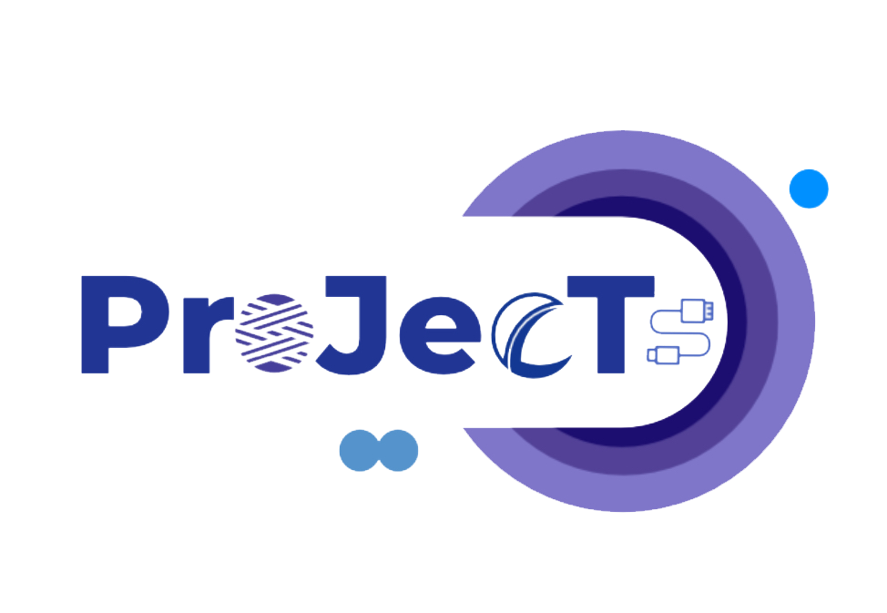

# Project
该工程用于Web工程作业。



该仓库为该服务的后端部分，前端部分请访问：

https://github.com/kokola99/vue_web

## 内容列表
- [Background](##Background)

- [deploy](##项目部署)
 
## Background
该项目用于解决项目小组内部合作的部分问题，比如说项目任务发布，项目进度时间线监控，项目公告和周报等问题的小型轻解决方案。

用户通过创建项目小组，将项目成员添加入小组内，组长可以发布通过发布任务，查看周报月报，制定项目计划。

用户加入小组后，通过承接任务和提交周报的方式，向组长汇报项目进度，提高项目管理效率和推进速度。

项目场景适用于小型团队中的任务管理和进度管理，方便快捷。

## 项目部署
将项目克隆至本地，在 Java11 的环境下编译打包。

在服务器中运行后台指令。进行项目部署。

环境需求：
1. Redis
2. MySQL 5.7

```bash
nohup java -jar <project file> <spring config> > <log name> 2>&1 &
```